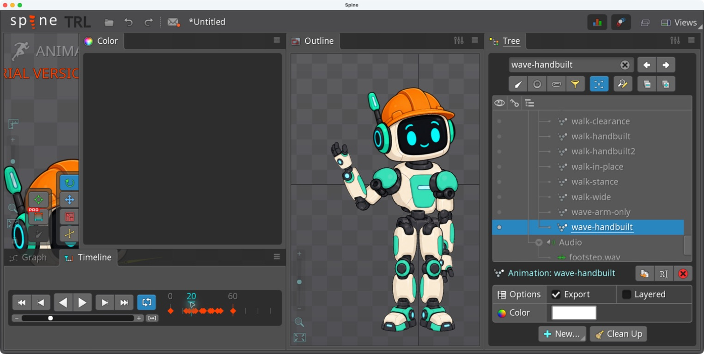

# Bài 75 — skin khác hình dáng dùng chung animation

Đã nhân bản `mint` thành `helmet` trên rig dựng tay và thay ảnh đầu bằng đầu đội mũ bảo hộ cam. Mũ làm thay đổi đường viền đầu; bốn tư thế thử vẫn dùng animation cũ.



## Cách dựng đã thực hiện

Trong Setup, chọn skin mint → Duplicate → helmet, để Rename attachments tắt. Bật helmet bằng chấm cạnh dòng skin, mở head → slot head → placeholder head → region head. Đổi Image path từ `mint/head` sang `helmet/head`; đặt Scale X/Y của region thành `0.22`. Giữ nguyên vị trí và góc của region, không sửa xương hay key.

Ảnh gốc mint là 283 × 259; ảnh mới là 1312 × 1199, RGBA có alpha trong suốt. Ở tỷ lệ 0.22, kích thước region mới khoảng 288.64 × 263.78 đơn vị. Tỷ lệ này phù hợp trong các tư thế quan sát; không phải công thức dùng chung cho mọi ảnh thay thế. Với ảnh khác, phải căn chỗ tiếp giáp cổ và kiểm tra khi đầu nghiêng.

Thao tác chọn dòng trong Tree chỉ chọn đối tượng; chấm cạnh skin/animation mới bật nó. Lần đầu đã tắt nhầm skin đang bật khiến robot biến mất; bật lại helmet khôi phục đủ ảnh. Duplicate đã tạo bản riêng: sau sửa helmet, bật mint ở cùng walk frame 22 vẫn thấy đầu nguyên bản.

## Bằng chứng và giới hạn

| Phép thử | Quan sát | Ảnh |
| --- | --- | --- |
| Wave frame 20 | Đầu nghiêng, mũ theo đầu, phần cổ nối liền | [20](../exercises/robot/evidence/helmet/wave-20.png) |
| Wave frame 40 | Tư thế tay khác, không thấy mũ chạm tay | [40](../exercises/robot/evidence/helmet/wave-40.png) |
| Walk frame 7 | Mũ theo tư thế đầu và thân | [7](../exercises/robot/evidence/helmet/walk-7.png) |
| Walk frame 22 | Cổ vẫn nối liền trong ảnh | [22](../exercises/robot/evidence/helmet/walk-22.png) |
| Đổi về mint cùng frame 22 | Đầu cũ còn nguyên, tư thế chân giữ nguyên | [mint](../exercises/robot/evidence/helmet/mint-walk-22.png) |

Đây là thay region có hình dáng mới, chưa phải trang phục biến dạng bằng mesh hoặc kiểm tra toàn bộ frame. Ảnh sinh có nét mặt hơi khác; chưa chứng minh bảo toàn pixel hay tỷ lệ khuôn mặt. Không cần sửa animation để đạt các tư thế thử này.

Kết thúc ở helmet, wave-handbuilt frame 20, dừng phát. Trial chưa lưu được project để mở lại; PNG và bằng chứng đã nằm trong thư mục dự án.

## Tài nguyên và prompt

[PNG sử dụng](../exercises/robot/images/parts/helmet/head.png). Tạo bằng image_gen tích hợp (built-in), không dùng CLI/API fallback. Lần đầu có nền caro bị vẽ vào ảnh RGB; lần hai đã tách nền thành RGBA và dùng nguyên file đó trong Spine.

Prompt tạo biến thể, với `mint/head.png` làm ảnh cần sửa:

```text
Use case: precise-object-edit. Asset type: replacement head sprite for the existing Spine robot, separate skin. Edit the referenced head into a construction-worker helmet variant. Keep the same friendly black face screen, cyan eyes and smile, cream jaw shape, three-quarter front orientation, mint ear pods, and original linework/rendering style. Add a clearly visible orange hard hat with a projecting brim and raised crown, changing the head silhouette. Keep the jaw/neck connection at the same relative bottom center. Keep the left antenna visible, passing beside the helmet. Head only; no neck, no body, no floating extra parts, no text or logo. Actual transparent RGBA background, not a baked checkerboard. Leave a little transparent margin so the brim and antenna are not clipped. Preserve facial proportions; this asset must replace the existing head while using the same bone and animation.
```

Prompt sửa nền, với kết quả lần đầu làm ảnh cần sửa:

```text
Use case: background-extraction. Keep the robot head with orange hard hat EXACTLY as shown. Remove the entire white and gray checkerboard background, including the openings around the antenna and helmet. Deliver a genuine RGBA PNG with alpha 0 outside the head. Do not draw transparency checkerboard, do not replace with white, do not add shadow. Preserve all head, helmet, antenna pixels and proportions as closely as possible. This is a cutout sprite for Spine, actual transparent background is required.
```
